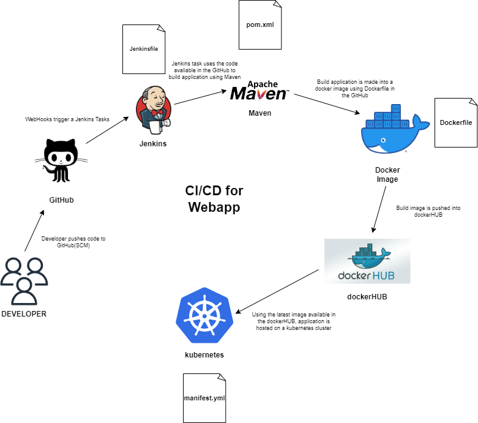
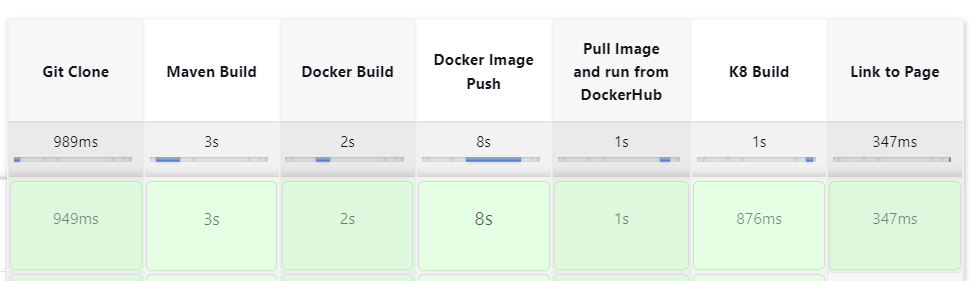
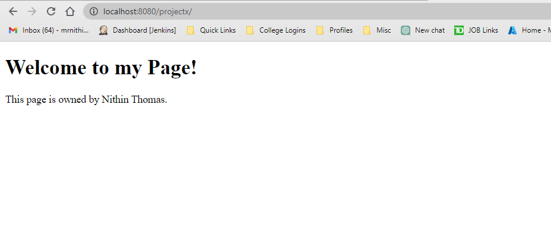

## Project X

This project is used to run a webapp using tomcat server.

## Prerequisites/tools needed to work on this project. 
 
- [tomcat image](https://hub.docker.com/_/tomcat)
- [dockerHUB](https://www.docker.com/products/docker-hub/)
- [Docker](https://docs.docker.com/get-started/overview/)
- [Jenkins](https://www.jenkins.io/doc/tutorials/)
- [Kubernetes](https://github.com/Krishnamohan-Yerrabilli/Kubernetes-hands-on)
- [Jenkins](https://www.jenkins.io/doc/tutorials/)

We will have a deployment over a `Kubernetes cluster` using `Jenkins CI/CD pipeline`,   
in this project, we are taking the help of various DevOps tools like GitHub, Jenkins,  
dockerHUB and a `Kubernetes`.

We will also learn about Kubernetes to know about this deployment and services and we   
will write 'Dockerfile', 'pom.xml', 'Jenkinsfile', 'manifest.yml' ect to execute the jenkins job.

## Agenda 

- The developer pushes the code to the GitHub repository.

- The GitHub repository is configured to trigger a Jenkins task upon receiving new code.

- Jenkins detects the code change and retrieves the Jenkinsfile from the GitHub repository.

- Jenkins starts the pipeline based on the instructions provided in the Jenkinsfile.

- The first step in the Jenkins pipeline is to clone the Git repository containing the code.

- Maven is invoked within the pipeline to perform a clean build of the project, ensuring that  
any previous artifacts or dependencies are removed and the project is built from scratch.

- Once the project is built, Docker is utilized to create a new Docker image using a preconfigured  
Dockerfile and a Tomcat Docker image as the base.

- The newly created Docker image is then pushed to Docker Hub, a public or private container  
registry for storing and sharing Docker images.

- With the Docker image available in Docker Hub, Kubernetes (K8s) is leveraged to deploy a pod. 
A pod is a basic unit of deployment in Kubernetes and can contain one or more containers.

- The Kubernetes deployment configuration references the Docker image from Docker Hub and specifies  
the desired number of replicas or instances to run.

- Once the pod is successfully deployed, the web application hosted within the pod becomes accessible.

- To access the web application, you can use the provided URL: http://localhost:8080/projectx.  
Replace "localhost" with the appropriate hostname or IP address if accessing from a remote machine 
or a different environment.

Please note that this step-by-step method assumes a basic understanding of the tools and technologies 
involved, including Git, GitHub, Jenkins, Maven, Docker, Docker Hub, and Kubernetes. It's also important  
to have the necessary configurations and dependencies set up correctly in order for the pipeline to run smoothly.

## Workflow

## Project Outputs

## 1. Jenkins Workflow Status

## 2. Hosted at Localhost/8080

